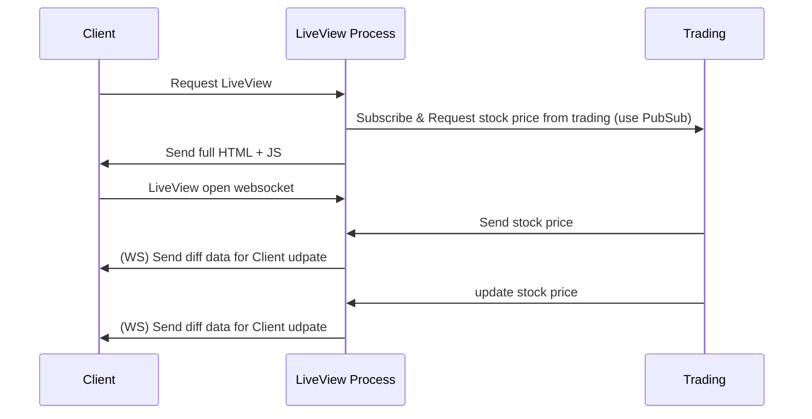

# Introduce

This is simple demo for sharing topic "Phoenix LiveView & Pubsub for Realtime & Scable webapp"

## structure of project

Project has two part frontend service & trading service.

Trading service is a simulator stock price & push stock price change to frontend.

Frontend show stock price from simulator by Phoenix LiveView.

Using Phoenix PubSub to transport data from trading to frontend.

### Flow of events



## Guide

For run demo, please follow step.

In case you are binding by other IP please change config and run commands.

Run trading_service first

```bash
cd trading_service
mix deps.get
iex --name trading@127.0.0.1 -S mix
```

Open new Terminal then run

```bash
cd frontend_service
mix deps.get
PORT=4001 iex --name frontend_1@127.0.0.1 -S mix phx.server
```

For multi frontend you can start other instance like

```bash
PORT=4002 iex --name frontend_2@127.0.0.1 -S mix phx.server
```

and join to trading service by above command.

Open browser then go to: 

dynamic stock list [http://localhost:4001/dynamic_list?from=1&to=1500](http://localhost:4001/dynamic_list?from=1&to=1500)

You can change number of stocks by change `num` in query parameter (from 1 to 10k)

fixed stock list [http://localhost:4001/fix_list](http://localhost:4001/fix_list)

custom stock list [http://localhost:4001/custom_list](http://localhost:4001/custom_list)
